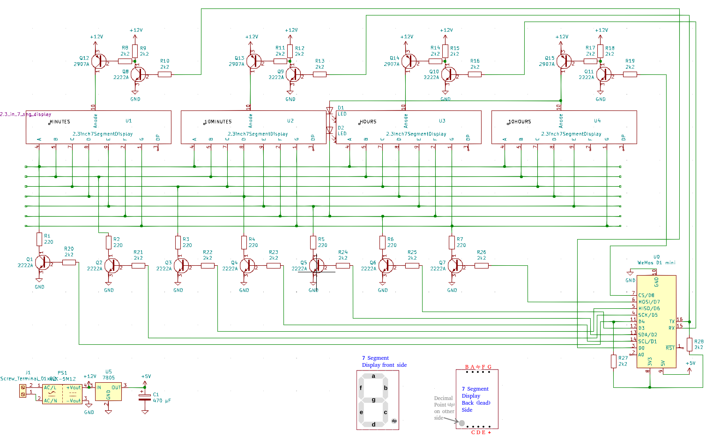
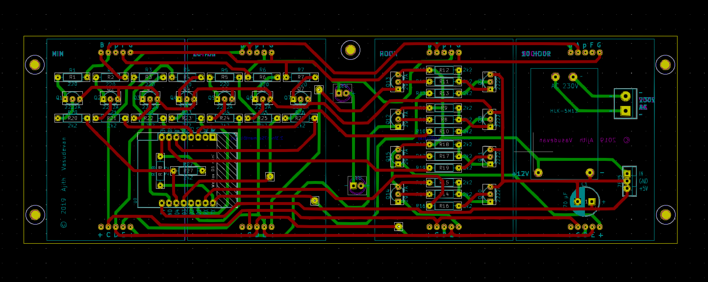
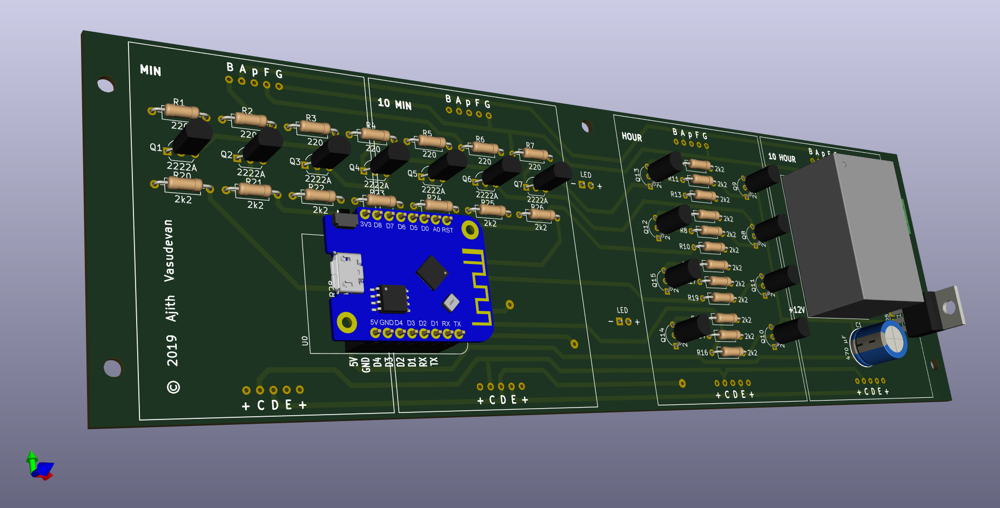
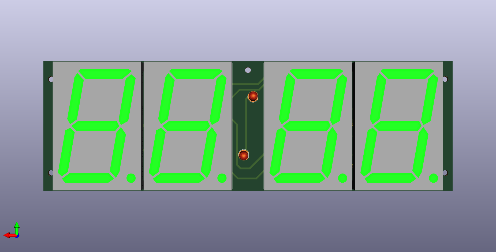

## Wemos Clock

This clock is based on the Wemos D1 Mini MCU and it keeps accurate time using NTP servers over the internet, just like regular computers.

### Schematic Diagram

### Parts List
1. 7-Segment Display units (2.3 inch high for this PCB design, otherwise, could be any size) - 4 Nos
2. Wemos D1 Mini - 1 No
3. General purpose NPN transistors (E.g., 2N 2222A)  - 11 Nos
4. General purpose PNP transistors (E.g., 2N 2907A)  - 4 Nos
5. Resistors - 2k2 Ω   - 21 Nos
6. Resistors - 220 Ω   -  7 Nos
7. 12V DC 5W Power supply module HLK-5M12 - 1 No
8. 5V Regulator IC 7805 - 1 No
9. Capacitor 470 μF  - No
10. PCB fabricated to the specifications [here](KiCAD/WemosClock.kicad_pcb)

### PCB

### PCB (3-D Model - component side)

### PCB (3-D Model - display side)

